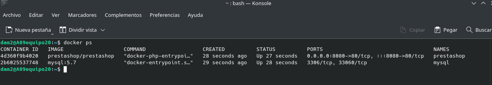
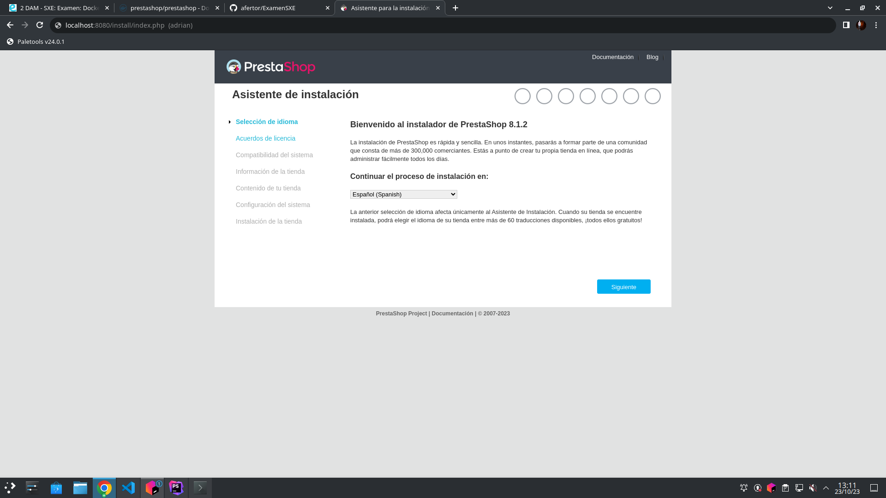

# ExamenSXE

## Ejecutar PrestaShop
Lo primero de todo es tener instalado tanto docker como docker compose instalados en nuestros equipos.

### 1. Primer paso.
Lo primero será crear un archivo llamado docker-compose.yml y dentro de el escribiremos el código el cual nos permitirá ejecutar PrestaShop. 

### 2. Segundo paso.
Lo siguiente que tendremos que hacer es entrar en la terminal y escribir el siguiente comando `docker-compose up -d` 

### 3. Tercer paso. 
Una vez finalice de descargar todo nos iremos a la terminal y escribiremos `docker ps` para comprobar que el contenedor esta en correcto funcionamiento como se muestra en la siguiente imagen: .

### 4. Cuarto paso. 
Ahora nos iremos al navegador para comprobar que todo esta funcionando. Para comprobarlo escribiremos lo siguiente en el navegador: `http://localhost:8080/install/` y nos debería aparecer lo siguiente y a partir de ahí acabaremos de instalar PrestaShop: